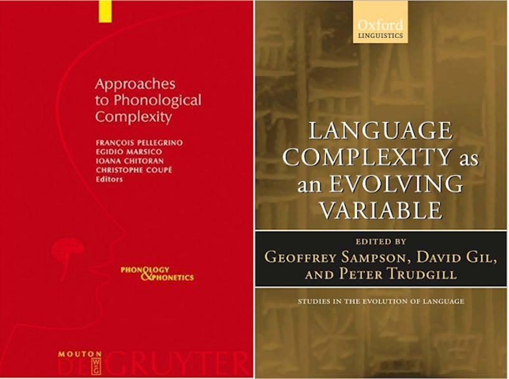

```{r setup, include=FALSE}
# setwd("/home/agricolamz/work/materials/2021.11.09_comparing_phonological_profiles")
knitr::opts_chunk$set(echo = FALSE, warning = FALSE, message = FALSE, dev='cairo_pdf')
options(tinytex.verbose = TRUE)
library(tidyverse)
# create qrcode
# library(qrcode)
# png(filename="images/00_qrcode.png", width = 150, height = 150)
# plot(qr_code("https://github.com/agricolamz/2021.11.09_comparing_phonological_profiles/raw/master/2021.11.09_comparing_phonological_profiles.pdf"))
# dev.off()
```

[//]: # (видео про энтропию [Ackerman, Molouf 2013]  https://www.youtube.com/watch?v=lr2wyyKCRRM)

## Why did I decide to give this talk?

* During the talk about "Geography and language divergence: the case of Andic languages" at our Lab

**Jeff Good:** How did you come up with the idea of calculating phonological distances? Is it some established procedure?

**Me:** No, we thought that this would be the most obvious step... \pause

* The second reason:

```{r list, echo = FALSE, cache=TRUE}
library(tweetrmd)
tweet_screenshot(tweet_url("LinguList", "1436623387141492739"))
```

## Why did I decide to give this talk?

The main reason for this talk is that I performed calculations of phonological distances (or supervised other people making calculations) for Circassian languages [@moroz21] and languages of the Andic branch of the East Caucasian family [@moroz20; @davidenko21; @tsyzova21], in order to get a simple distance between different idioms, that is less connected to language phylogeny. \pause

But does this measure make any sense? How can we compare phonological profiles of languages? \pause

Unlike lexicostatistical distance, phonological distance can be evidence for language contact, since languages can adopt some phonological feature or property from a contact language (see [@andersson17]). This can possibly be explained by the **Perceptual Magnet framework** [@blevins17]. In most cases phonological change in unrelated languages is more salient to linguists, however it is worth mentioning that there is at least one study about how to catch contact-induced phonological change in related languages [@bowern13].

##  Materials for the analysis

Materials for the calculation of phonological distance can be different:

* segment\footnote[frame]{Let's leave the phonology vs. phonetics debate aside.} inventory (and grammar, if you are lucky);
* dictionaries;
* parallel dictionaries;
* corpora;
* parallel corpora.

\setcounter{footnote}{0}

# Criticism by [@simpson99]

## Criticism by [@simpson99]

[@simpson99] criticizes UPSID\footnote[frame]{UPSID stands for UCLA Phonological Segment Inventory Database \citep{maddieson87}, which consists of the phonemic systems of a
representative sample of 451 (this number changes from publication to publication) of the world's languages in machine-readable form. UPSID can be accessed via the PHOIBLE database \citep{phoible19}.}-like researches: 

* phonemes mask allophones
    * Standard High German /ç/ stands for [ç], [x] and [χ];
    * "The allophone no longer represents the phoneme, it *replaces* it";
* the phonological relations between segments are lost
    * it is impossible to get information about e.g. vowel harmony by comparing just vowel inventories;
* there is no non-arbitrary way of assigning phonological features (e.g. SPE [@chomsky68]) to segments. \pause

My metaphor: omelets and pancakes share the same ingredients, but they are significantly different meals.

\setcounter{footnote}{0}

#  Complexity-based approaches

## [@pellegrino09] and [@sampson09]

```{r, fig.align='center'}

```

## [@pellegrino09] and [@sampson09]

* [@pellegrino09]
    * [@ohala09]
    * [@maddieson09]
    * [@coupe09]
* [@sampson09]
    * [@nichols09]
    * [@deutscher09]

## [@nichols09]

The main goal of this paper was to calculate the overall complexity for a typological sample of languages based on phonology, synthesis, classification (gender, numeral classifiers), syntax, and lexicon. The main goal was to prove:

* that all languages **are not** equal in complexity;
* that different parts of grammar **do not** compensate for complexity in other parts of grammar. \pause

### Phonological features in the 
* number of contrastive manners of articulation in stops;
* number of vowel quality distinctions;
* tone system (none/simple/complex, after [@maddieson13b]);
* syllable structure (after [@maddieson13a]).

## [@nichols09: 116]: results

```{r, fig.align='center'}
knitr::include_graphics("images/nichols09.png", dpi = 200)
```

Phonological complexity (N = 137)

## [@ohala09]

'Secondary distinctive features' are important for phonologization:

* nasals in French: saint [sɛ̃] < Latin sanctus 'holy';
* average F0 contour of vowels following English stops is falling after voiceless and rising after voiced.

They are not captured by the segmental inventories.

Allophones, like English /t/: [tʰ] vs [t] vs [ɾ] (cf [@simpson99]).

## [@maddieson09]

* Merged measure for consonants, vowels, tones and syllable structure;

```{r}
knitr::include_graphics("images/maddieson09_ci.png", dpi = 420)
```

## [@maddieson09]

* Merged measure for consonants, vowels, tones and syllable structure;

```{r}
knitr::include_graphics("images/maddieson09_cm.png", dpi = 420)
```

## [@maddieson09]

* Merged measure for consonants, vowels, tones and syllable structure;
* The number of possible distinct syllables allowed by the language (cf [@shosted06]);
* Frequency measures based on lexicon or texts (cf [@davidenko21] for Andic):

"To compare these data, it is useful to calculate some kind of index. There are a number of ways this might be done. One possibility is to calculate a summed frequency $\times$ complexity score over the top ten segments, in which each segment contributes decreasingly according to its rank, and increasingly according to its complexity". [@maddieson09: 97]

## [@coupe09]

* In this work the authors use phonological features as distances between segments and then use graphs with segments as the nodes and distances as the edges:

```{r, fig.align='center'}
knitr::include_graphics("images/coupe09.png", dpi = 380)
```

## [@coupe09]

* In this work the authors use phonological features as distances between segments and then use graphs with segments as the nodes and distances as the edges:
* Then, the authors use the *off-diagonal complexity* proposed by [@claussen07],\footnote[frame]{Their motivation for this choice, was that this measure
\begin{itemize}
\item does not explicitly take into account graph size;
\item is sensitive to the presence of hierarchical sub-structures in the network;
\item is minimal for regular graphs and maximal for free-scale graphs.
\end{itemize}
Unfortunately, off-diagonal complexity can not be calculated for valued graphs, so authors were ought to drop phonologcial distance values from their graphs.
} which makes it possible to disassociate from linguistics and phonology and rely purely on graph structure.

\setcounter{footnote}{0}

## [@deutscher09]

* 'All Languages are Equally Complex' --- is a myth (actually, a lot of papers from [@sampson09] state the same).
* Complexity is a polysemous notion: some scholars focus on the multipartite nature of language, others on the complicated relations within the system.
* Overall complexity is better to present as a vector of values rather than one value.

## Conclusions

Despite the criticism that a language's phonological system is a complex system that can not be reduced to the set of its elements [@simpson99; @ohala09; @coupe09; @deutscher09], I think that any phonological complexity measure can be used in order to compare different languages. The sophistication and granularity of this measure will influence the possible effect size gathered by this measure.

#  Distance-based approaches

## Distance-based approaches

* [@hoppenbrouwers01] (after [@heeringa04])
* [@nerbonne01] (after [@heeringa04])
* [@heeringa04]
* [@eden18]
* [@anderson21]

## [@anderson21]

In this paper the authors apply the **Jaccard similarity** between two phoneme inventories, that is a ratio of similar segments in two languages out of all the possible segments in two languages. \pause

The reason why authors do this, is because their goal is to compare different inventories of the **same** languages across four databases of phonological inventories (UPSID [@maddieson87], LAPSyD [@maddieson13], Core PHOIBLE [@phoible19], JIPA [@baird21]). The results are unfavorable: researchers found a high degree of variation across datasets.

## [@hoppenbrouwers01] after [@heeringa04]

* Extract frequencies of units (these can be segments, syllables or phonological features) from corpora or dictionaries.
* The distance between two languages is the sum of the differences between the corresponding unit frequencies.

## [@nerbonne01] after [@heeringa04]

The authors applied the same stratagy as [@hoppenbrouwers01], but used words as corpora. So the idiom distance is calculated as an average word distance.

## [@heeringa04]

Since the methods of [@hoppenbrouwers01] and [@nerbonne01] do not account for unit order, Heeringa decided to use the Levenstein distance [@levenstein65]. The Levenstein distance is the minimum number of unit edits (insertions, deletions or substitutions) that should be applied to the unit string in order to get another:

* the distance between *pancake* and *omelet* is `r stringdist::stringdist("pancake", "omelet")`
* the distance between *pancake* and *cake* is `r stringdist::stringdist("pancake", "cake")`
* the distance between *sing* and *sign* is `r stringdist::stringdist("sing", "sign")`

Shortcoming:

* diphthong vs. vowel + consonant combination (/au/ or /aw/?);
* suprasegmental features;
* sequence length: the longer the sequences, the greater the chance of differences between them.

## [@heeringa04]

To address the sequence length problem [@heeringa04] uses normalization by the length of the alignment:

```{r, fig.align='center'}
knitr::include_graphics("images/heeringa04_norm.png", dpi = 400)
```

All four examples are normalized by the value 3.

## [@heeringa04]: interlanguage stimuli mismatch 

* It is possible that for one of the pair of idioms one lacks stimuli, in which case the effect of this stimulus is discounted.
* In case of multiple transcriptions they are matched according the minimum distance:
    * L1: [hys]; L2: [hys] and [hus]
    * L1: [hys] and [hus]; L2: [hys] and [hus]

## [@eden18]

* Parametric typology:
    * annotate languages according to 27 syllable structure parameters, and 29 inventory parameters;
    * apply Hamming distance,\footnote[frame]{This is just an ordered version of the Jaccard distance: the ratio of similar units in two languages out of all possible units in two languages.}
* Cross-entropy of the transcribed example texts

\setcounter{footnote}{0}

## [@eden18]: Shannon information entropy 

Entropy is a measure of randomness or uncertainty proposed by [@shannon48].

$$H(X) = - \sum_{i = 1}^n{P(x_i)\times\log_2P(x_i)}$$

Possible entropy values are $H(X) \in [0, +\infty]$: 

```{r}
tibble(a = c("A", "A", "A", "A", "B"),
       b = c("A", "A", "A", "B", "B"),
       c = c("A", "A", "B", "B", "B"),
       e = c("A", "A", "B", "B", "C"),
       f = c("A", "B", "C", "A", "B"),
       g = c("A", "A", "A", "A", "A")) %>% 
  pivot_longer(names_to = "id", values_to = "value", a:g) %>% 
  group_by(id) %>% 
  mutate(data = str_c(value, collapse = "-")) %>% 
  count(data, value) %>% 
  mutate(ratio = n/sum(n)) %>% 
  group_by(data) %>% 
  summarise(entropy = round(-sum(ratio*log2(ratio)), 2)) %>% 
  arrange(entropy) %>% 
  rename(dataset = data) %>% 
  knitr::kable()
```

## [@eden18]: Cross-entropy 

A cross-entropy measure is used in order to compare the two distributions $X$ and $Y$:

$$H(X, Y) = - \sum_{i = 1}^n{P(x_i)\times\log_2P(y_i)}$$


```{r cross_entropy, cache=TRUE}
cross.entropy <- function(p, phat){
  x <- 0
  for (i in 1:length(p)){
    x <- x + (p[i] * log2(phat[i]))
  }
  return(-x)
}

tibble(a = c("A", "A", "A", "A", "B"),
       b = c("A", "A", "A", "A", "B"),
       c = c("A", "A", "A", "B", "B"),
       d = c("A", "A", "B", "B", "B")) %>% 
  pivot_longer(names_to = "id", values_to = "value", a:d) %>% 
  group_by(id) %>% 
  mutate(data = str_c(value, collapse = "-")) %>% 
  count(data, value) %>% 
  mutate(ratio = n/sum(n)) %>% 
  ungroup()->
  ratios

combn(c(letters[1:4]), 2) %>% 
  t() %>% 
  as.data.frame() %>% 
  distinct() ->
  stimuli

map_dfr(1:nrow(stimuli), function(i){
ratios %>% 
  filter(id %in% stimuli[i,]) %>% 
  select(-n, -data) %>% 
  pivot_wider(names_from = id, values_from = ratio, values_fill = 0) %>% 
  select(-value) %>% 
  summarise(data_1 = ratios %>% filter(id %in% stimuli[i,1]) %>% distinct(data) %>%  pull(data),
            cross_entropy = round(cross.entropy(p = unlist(.[,1]), phat = unlist(.[,2])), 2),
            data_2 = ratios %>% filter(id %in% stimuli[i,2]) %>% distinct(data) %>%  pull(data))
}) %>% 
  arrange(cross_entropy) %>% 
  rename(`cross-entropy` = cross_entropy,
         `first dataset` = data_1,
         `second dataset` = data_2) %>% 
  distinct() %>% 
  knitr::kable()
```


## [@eden18]: Kullback-Leibler divergence

As we have seen, if the distributions $X$ and $Y$ are equal, then the cross-entropy is equal to the entropy of that distribution. So there is a way to normalize it, called the Kullback-Leibler divergence measure:

$$D_{KL}(P\parallel Q) = H(P, Q) − H(P )$$

```{r kullback_leibler, cache=TRUE}
entropy <- function(d){
  x <- 0
  for (i in d){
    x <- x + (i * log(i, base = 2))
  }
  return(-x)
}

tibble(a = c("A", "A", "A", "A", "B"),
       b = c("A", "A", "A", "A", "B"),
       c = c("A", "A", "A", "B", "B"),
       d = c("A", "A", "B", "B", "B")) %>% 
  pivot_longer(names_to = "id", values_to = "value", a:d) %>% 
  group_by(id) %>% 
  mutate(data = str_c(value, collapse = "-")) %>% 
  count(data, value) %>% 
  mutate(ratio = n/sum(n)) %>% 
  ungroup()->
  ratios

combn(c(letters[1:4]), 2) %>% 
  t() %>% 
  as.data.frame() %>% 
  distinct() ->
  stimuli

map_dfr(1:nrow(stimuli), function(i){
ratios %>% 
  filter(id %in% stimuli[i,]) %>% 
  select(-n, -data) %>% 
  pivot_wider(names_from = id, values_from = ratio, values_fill = 0) %>% 
  select(-value) %>% 
  summarise(data_1 = ratios %>% filter(id %in% stimuli[i,1]) %>% distinct(data) %>%  pull(data),
            entropy = round(entropy(d = unlist(.[,1])), 2),
            cross_entropy = round(cross.entropy(p = unlist(.[,1]), phat = unlist(.[,2])), 2),
            kullback_leibler =cross_entropy-entropy,
            data_2 = ratios %>% filter(id %in% stimuli[i,2]) %>% distinct(data) %>%  pull(data))
}) %>%  
  select(-entropy, -cross_entropy) %>% 
  arrange(kullback_leibler) %>% 
  distinct() %>% 
  rename(`Kullback-Leibler` = kullback_leibler,
         `first dataset` = data_1,
         `second dataset` = data_2) %>% 
  knitr::kable()
```

## [@eden18]: application (greater circles stand for similar languages)

* 7 languages from the corpus of European languages (Portuguese, French, Spanish, German, English, Dutch, Greek)

```{r, fig.align='center'}
knitr::include_graphics("images/eden18.png", dpi = 50)
```

## [@eden18]: application

* 7 languages from the corpus of European languages (Portuguese, French, Spanish, German, English, Dutch, Greek)
* Pearson correlation between some metrics:

|                                 | Parameter | Entropy: IPA | Entropy: static binary features |
|---------------------------------|-----------|--------------|---------------------------------|
| Entropy: IPA                    | 0.67      |              |                                 |
| Entropy: static binary features | 0.55      | 0.94         |                                 |
| Entropy: ls binary features     | 0.33      | 0.46         | 0.38                            |

## Conclusions

In this talk I presented multiple methods of calculating the phonological distances between languages. \pause

It is worth noting all of the arguments against using segment inventories as a measure [@simpson99; @ohala09; @coupe09; @deutscher09], but dictionaries and corpora are not freely available for any language. \pause

Both complexity-based and distance-based approaches are valid for language comparison:

* the complexity-based approach probably is better by design, but it depends on a feature set that should be chosen by linguists;
* the distance-based approach is better in capturing all phonotactic details present in the data (as [@maddieson09] proposed), but it depends on more or less comparable data from different languages. \pause

Acoustic distances in [@heeringa04] and [@eden18]!

## {}

\LARGE Thank you for your attention!

# References {.allowframebreaks}
