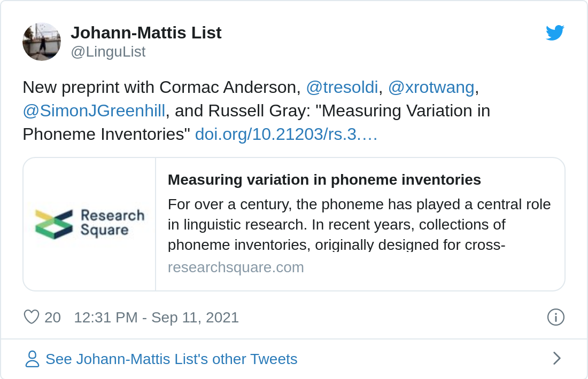

[//]: # (видео про энтропию [Ackerman, Molouf 2013]  https://www.youtube.com/watch?v=lr2wyyKCRRM)

## How I decided to give this talk?

* During the talk in our Lab with Misha and Ezequiel

**Jeff Good:** How you came up with the idea of calculating phonological distances? Is it some established procedure?

**Me:** No, we thought that it is the most obvious step... \pause

* The second reason:

<!-- --> 

## How I decided to give this talk?

The main reason for this talk is that I performed calculation of phonological distances (or caused people to do so) for Circassian languages [@moroz21] and Andic branch of East Caucasian languages [@moroz20; @davidenko21; @tsyzova21] in order to get a simple less-connected to language phylogeny distance between different idioms. \pause

But does this measure make any sense? How can we compare phonological profiles of languages? \pause

Unlike lexicostatistical distance the phonological distance can be an evidence for language contact, since languages can adopt some feature or property of another (see [@andersson17]). This can be possible explained by **Perceptual Magnet framework** [@blevins17]. In most cases phonological change in unrelated languages is more salient to linguists, however it is worth mentioning that there is a work about how to catch contact-induced change in related languages [@bowern13].

##  Materials for the analysis

Materials for the phonological distance calculation can be different:

* segment\footnote[frame]{Lets leave the phonology vs. phonetics debate aside.} inventory (and grammar, if you are lucky);
* dictionaries;
* parallel corpora;
* unparalleled corpora.

\setcounter{footnote}{0}

# Criticism by [@simpson99]

## Criticism by [@simpson99]

[@simpson99] attacks UPSID\footnote[frame]{UPSID stands for UCLA Phonological Segment Inventory Database \citep{maddieson87} which consists of the phonemic systems of a
representative sample of 451 (this number changes from publication to publication) of the world's languages in machine-readable form. Now UPSID can be accessed via PHOIBLE database \citep{phoible19}.}-like researches:

* phoneme masks allophones
    * Standard High German /ç/ stands for [ç], [x] and [χ];
    * "The allophone no longer represents the phoneme, it *replaces* it";
* phonological relations between segments is lost
    * comparing just vowel inventories it is impossible to get information about e. g. vowel harmony;
* there is no non-arbitrary way of assign phonological features (e. g. SPE [@chomsky68]) to segments. \pause

My metaphor: omelet and pancakes share all ingredients, but they are significantly different meals.

\setcounter{footnote}{0}

#  Complexity based approaches

## [@pellegrino09] and [@sampson09]

\begin{center}\includegraphics[width=16.75in]{images/complexity} \end{center}

## [@pellegrino09] and [@sampson09]

* [@pellegrino09]
    * [@ohala09]
    * [@maddieson09]
    * [@coupe09]
* [@sampson09]
    * [@nichols09]
    * [@deutscher09]

## [@nichols09]

The main goal of this paper is to calculate overall complexity for a typological sample of languages based on phonology, synthesis, classification (gender, numeral classifiers), syntax, and lexicon. The main goal is too prove:

* that all languages **are not** equal in complexity;
* that different parts of grammar **do not** compensate for complexity in other parts of grammar. \pause

### Phonological features in the 
* number of contrastive manners of articulation in stops;
* number of vowel quality distinctions;
* tone system (none/simple/complex, after [@maddieson13b]);
* syllable structure (after [@maddieson13a]).

## [@nichols09: 116]: results

\begin{center}\includegraphics[width=2.52in]{images/nichols09} \end{center}

Phonological complexity (N = 137)

## [@ohala09]

'Secondary distinctive features' are important for phonologization:

* nasals in French: saint [sɛ̃] < Latin sanctus 'holy';
* average F0 contour of vowels following English stops is falling after voiceless and rising after voiced.

They are not captured by the segmental inventories.

Allophones, like English /t/: [tʰ] vs [t] vs [ɾ] (cf [@simpson99]).

## [@maddieson09]

* Merged measure for consonants, vowels, tones and syllable structure;

\includegraphics[width=4.52in]{images/maddieson09_ci} 

## [@maddieson09]

* Merged measure for consonants, vowels, tones and syllable structure;

\includegraphics[width=4.31in]{images/maddieson09_cm} 

## [@maddieson09]

* Merged measure for consonants, vowels, tones and syllable structure;
* The number of possible distinct syllables allowed by the language (cf [@shosted06]);
* Frequency measures based on lexicon or texts (cf [@davidenko21] for Andic):

"To compare these data, it is useful to calculate some kind of index. There are a number of ways this might be done. One possibility is to calculate a summed frequency $\times$ complexity score over the top ten segments, in which each segment contributes decreasingly according to its rank, and increasingly according to its complexity". [@maddieson09: 97]

## [@coupe09]

* In this work authors use phonological features as a distances between segments and then use graphs with segments in the nodes and distances in the edges:

\begin{center}\includegraphics[width=4.61in]{images/coupe09} \end{center}

## [@coupe09]

* In this work authors use phonological features as a distances between segments and then use graphs with segments in the nodes and distances in the edges.
* Afterwords authors use *off-diagonal complexity* proposed by [@claussen07]\footnote[frame]{Authors motivated their choice, because this measure
\begin{itemize}
\item does not explicitly take into account graph size;
\item is sensitive to the presence of hierarchical sub-structures in the network;
\item is minimal for regular graphs and maximal for free-scale graphs.
\end{itemize}
Unfortunately, off-diagonal complexity can not be calculated for valued graphs, so authors were ought to drop phonologcial distance values from their graphs.
} that make it possible to disassociate from linguistics and phonology and rely purely on graph structure.

\setcounter{footnote}{0}

## [@deutscher09]

* 'All Languages are Equally Complex' --- is a legend (actually, a lot of papers from [@sampson09] state the same).
* Complexity is a polysemous notion: some scholars focus on multipartite nature of language, others on complicated relations within the system.
* Overall complexity is better to present as a vector of values rather then one value.

## Conclusions

Despite of the critics that language phonological system is a complex system that can not be reduced to the set of its elements [@simpson99; @ohala09; @coupe09; @deutscher09] I think that any phonological complexity measure can be used in order to compare different languages. The sophistication and granularity of this measure will influence the possible effect size gathered by this measure.

#  Distance based approaches

## Distance based approaches

* [@hoppenbrouwers01] (after [@heeringa04])
* [@nerbonne01]
* [@heeringa04]
* [@eden18]
* [@anderson21]

## [@anderson21]

In this paper authors apply **Jaccard similarity** between two phoneme inventories, that is ratio of similar segments in two languages out of all possible segments in two languages. \pause

The reason, why authors do that is because their goal is to compare different inventories of the **same** languages across four databases of phonological inventories (UPSID [@maddieson87], LAPSyD [@maddieson13], Core PHOIBLE [@phoible19], JIPA [@baird21]). The results are unfavorable: researchers found a high degree of variation across datasets.

## [@hoppenbrouwers01] after [@heeringa04]

* Extract unit (it can be segments, syllables or phonological features) frequencies from corpora or dictionary.
* The distance between two languages is the sum of the differences between the corresponding unit frequencies.

## [@nerbonne01] after [@heeringa04]

Authors applied the same stratagy as [@hoppenbrouwers01], but used words as a corpora. So the idiom distance is calculated as an average word distance.

## [@heeringa04]

Since [@hoppenbrouwers01] and [@nerbonne01] methods does not account for unit order Heeringa decided to use Levenstein distance [@levenstein65]. The Levenstein distance is the minimum number of unit edits (insertions, deletions or substitutions) that should be applied to the unit string in order to get another:

* the distance between *sing* and *king* is 1
* the distance between *sing* and *sign* is 1
* the distance between *sing* and *sight* is 3

Shortcoming:

* diphthong vs. vowel + consonant combination (/au/ or /aw/?);
* suprasegmental features;
* sequence length: the longer the sequences, the greater the chance of differences between them.

## [@heeringa04]

To address the sequence length problem [@heeringa04] uses normalization by the length of the alignment:

\begin{center}\includegraphics[width=4.52in]{images/heeringa04_norm} \end{center}

All four examples are normalized by the value 3.

## [@heeringa04]: interlanguage stimuli mismatch 

* It is possible that for one of the pair of idioms one lack stimuli, then the effect of this stimuli is discounted.
* In case of multiple transcription they are matched according the minimum distance:
    * L1: [hys]; L2: [hys] and [hus]
    * L1: [hys] and [hus]; L2: [hys] and [hus]

## [@eden18]

## Conclusions

## {}

\LARGE Thank you for your attention!

# References {.allowframebreaks}
